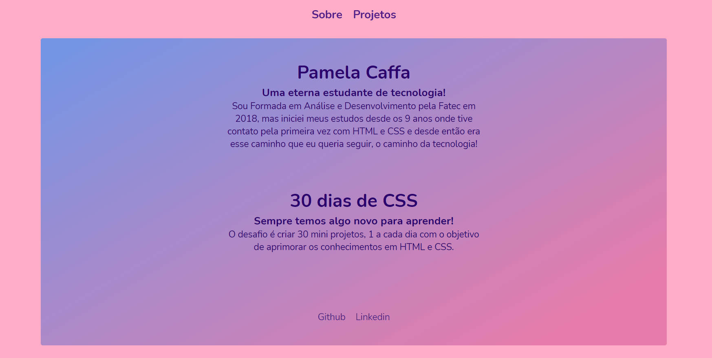

# 🚀 30 dias de CSS

 
  <a href="https://pamelacaffa-30dayscss.netlify.app/" target="_blank">Demo on Netlify
  </a>

&nbsp;&nbsp;

## 🎯 Objetivo
Comecei o desafio no dia 1º de Dezembro de 2020 com o objetivo de aprimorar os meus conhecimentos em HTML5 e CSS3. Fui inspirada por várias pessoas do meu LinkedIn e 2 delas são [Juliane Pires](https://github.com/JulianePires/30diasDeCSS) e [Milena Carecho](https://github.com/MilenaCarecho/30diasDeCSS#id01) também segui alguns tutoriais desses canais: [Coding Artist](https://www.youtube.com/channel/UC15exV5s79D_aYGADudlwpQ) e [DarkCode](https://www.youtube.com/channel/UCD3KVjbb7aq2OiOffuungzw)

&nbsp;&nbsp;

---

&nbsp;&nbsp;

## 📖 Regras gerais
* Realizar um projeto por dia
* Compartilhe seu progresso nas mídias sociais (Twitter, Facebook, Linkedin etc.) usando a hashtag #30diasDeCSS
* O projeto deve ser concluído até 23:59

&nbsp;&nbsp;

---

&nbsp;&nbsp;

## 💜 Regras pra mim
* Criar uma página e disponibilizar todos os projetos deste desafio.
* Compartilhar os projetos nas redes a cada 5 concluídos.
* Para cada dia sem postar um projeto, fazer um resumo em inglês do projeto atrasado. (estudar mais um pouco de inglês não faz mal 😉)
* No final do desafio adicionar responsividade aos projetos que ainda não possuir.

&nbsp;&nbsp;

---

&nbsp;&nbsp;

## 📂 Licença

Distribuído sob a licença MIT. Veja `LICENSE` para mais informações.